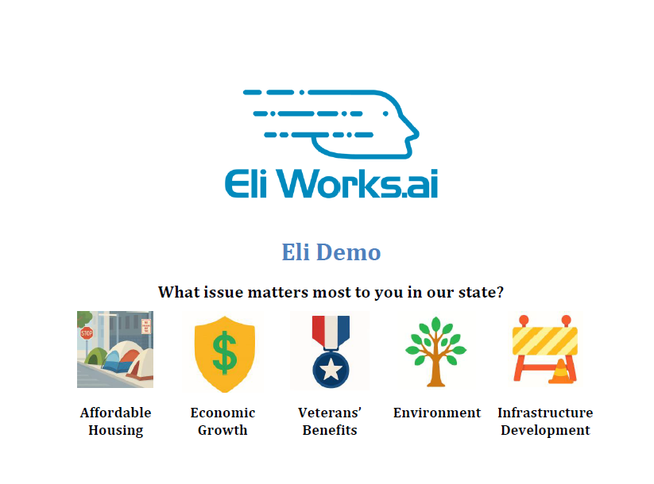

# Eliworks User Guide

Welcome to the Eliworks AI Feedback System! This guide will walk you through all the features of the platform and how to use them to run successful feedback campaigns.

## Table of Contents
1.  [The Campaign Dashboard](#1-the-campaign-dashboard)
2.  [Creating a New Campaign](#2-creating-a-new-campaign)
3.  [Managing Your Campaigns](#3-managing-your-campaigns)
4.  [Viewing and Generating Reports](#4-viewing-and-generating-reports)
5.  [Sharing Your Campaign](#5-sharing-your-campaign)

---

### 1. The Campaign Dashboard

The **Campaign Dashboard** is the first page you see when you open the application. It provides a high-level overview of all your active and past campaigns. Each campaign is displayed on a "card."

Each card shows you:
- **Campaign Name and Client**: The titles you've given your campaign.
- **Main Question**: The primary question your audience will be asked.
- **Issue Breakdown (Pie Chart)**: A live pie chart showing which initial topics your audience is clicking on most.
- **Engagement Funnel (Line Chart)**: A line chart that shows how many people are progressing through the chat. This helps you understand if people are dropping off at a certain question.

---

### 2. Creating a New Campaign

You can create a new campaign in just a few clicks.

#### Step 1: Open the Creation Form
From the dashboard, click the **+ Create New Campaign** button in the top right. This will open the campaign creation form.

#### Step 2: Use the AI Assistant (Recommended)
The easiest way to create a campaign is with the AI assistant.
1.  **Enter a Theme**: In the "Campaign Theme" box, type a simple phrase describing your goal. For example: `improving local schools` or `support for small business`.
2.  **Click "Generate with AI"**: The AI will automatically fill in a catchy **Campaign Name**, an engaging **Main Question**, and five relevant **Topics** with emojis.
3.  **Review and Edit**: You can edit any of the AI-generated fields to fine-tune your message.

#### Step 3: Manual Creation
If you prefer, you can fill in all the fields manually:
- **Campaign Name**: A title for your campaign (e.g., "NY State Education Pulse").
- **Client**: The client or organization this campaign is for.
- **Main Question**: The first question users will see.
- **Topics**: Click "+ Add Topic" to create at least five topics. Each should have a short name and a relevant emoji.

#### Step 4: Save the Campaign
Once you are happy with the details, click **Save Campaign**. Your new campaign card will immediately appear on the dashboard.

---

### 3. Managing Your Campaigns

The campaign dashboard is your mission control. From each campaign card, you have several options:

- **Launch Chat**: Click this to open the live chat interface for that campaign in a new tab. This is useful for testing the user experience.
- **View Saved Reports**: Access a list of all the intelligence reports you have previously generated and saved for this campaign.
- **View Report**: Takes you to the main reporting page for the campaign. This is where you can see the latest data and generate new reports.
- **Share**: Opens a pop-up with a shareable link and a QR code for your campaign.

---

### 4. Viewing and Generating Reports

The most powerful feature of Eliworks is the AI-powered reporting.

#### Step 1: Navigate to the Report Page
On a campaign card, click **View Report**. This will take you to the report page, which shows a sample report by default.

#### Step 2: Generate a New Report
Click the **Generate New Report** button in the navigation bar. The system will:
1.  Gather all conversations for that specific campaign.
2.  Send the data to the Gemini AI for analysis.
3.  Display a comprehensive, nine-section report.

This process can take a few moments, and you will see a loading indicator while the AI works.

#### Step 3: Save Your Report
Once a report is generated, a **Save Report** button will appear at the top. Click it to save the current report as an HTML file. This is highly recommended, as it preserves the analysis at that moment in time.

You can view all your saved reports for that campaign by clicking **View Saved Reports** on the campaign card.

---

### 5. Sharing Your Campaign

Getting your campaign in front of your audience is easy.

1.  On the campaign card, click the **Share** button.
2.  A modal window will appear with:
    - **A QR Code**: Perfect for use on printed materials like posters, flyers, and mailers. Users can scan it with their phone camera to be taken directly to the chat.
    - **A Direct URL**: You can copy this link and share it on social media, in emails, or on your website.

This ensures users are taken directly to the campaign you want them to participate in, with no other distractions. 